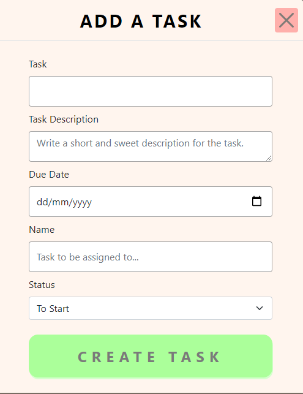
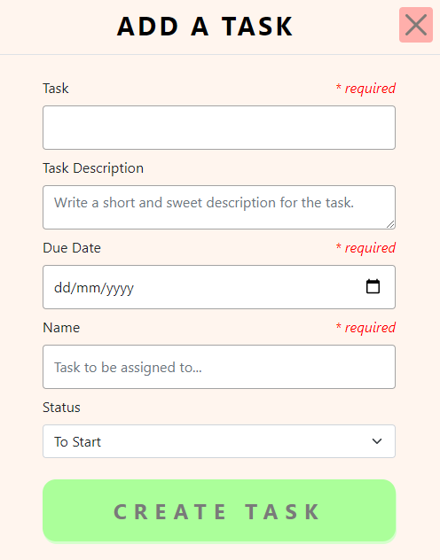
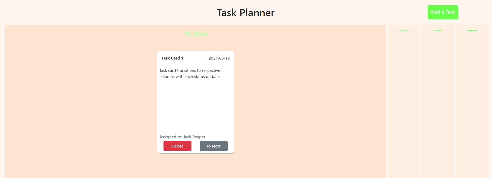

# finalproject_Naveen_JJ_Yiteng
Jr Web Developer Final Project Cohort 5- Task Planner Web App

# Team members
Yiteng Huang, JJ Chang, Naveen Kotha.

# General Objectives
Create a Task Planner web app from scratch.
Demonstrate the technical and non-technical skills developed during the Junior Web Developer program.

# Details
This project has 10 tasks (~3 hours each) divided into 3 Sprints.
Each Sprint will have a sprint retrospective in your Sprint Closing session at the end following the Scrum methodology.
At the end of the project, the group will do a final project presentation to the entire class.

- Task 1: Design your App Wireframes
- Task 2: Implement your Wireframes using Bootstrap
- Task 3: Create a Task Card layout and a Task List component
- Task 4: Task Form Inputs Validation
- Task 5: Adding Tasks
- Task 6: Adding Tasks Programmatically
- Task 7: Display The Tasks
- Task 8: Update A Task
- Task 9: Persisting Tasks to LocalStorage
- Task 10: Deleting Tasks

# Front-end Languages
- HTML
- CSS
- JavaScript

# Framework
- Bootstrap

# Library
- Jquery

# Completed Project

[Click for live example](https://jwd005.github.io/finalproject_Naveen_JJ_Yiteng/)

# modal form

# validation 
- Task Form Inputs Validation.

# columns
- Task card transitions to respective columns with each update from 'Start' to 'Complete'.

